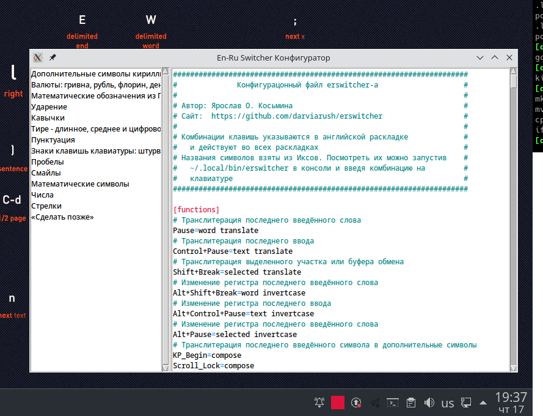

# NAME

**erswitcher** _(EN—RU Switcher)_ — транслитератор текста и переключатель клавиатуры

# VERSION

6

# SYNOPSIS

⌨ **erswitcher** — приложение Иксов _(X11)_.

Он реагирует на следующие комбинации клавиш:

* `⎉Pause` — транслитерировать последнее введённое с клавиатуры слово (только что набранный текст от курсора назад до пробела).
* `⎈Control+⎉Pause` — транслитерировать последний введённый с клавиатуры текст.
* `⇧Shift+⎉Pause` — транслитерировать выделенный текст.
* `⎇Alt+⎉Pause` — инвертировать регистр символов в выделенном тексте.
* `⎇Alt+⇧Shift+⎉Pause` — инвертировать регистр символов в последнем введённом слове.
* `⎇Alt+⎈Control+⎉Pause` — инвертировать регистр символов в последнем введённом тексте.
* `Scroll_Lock` или `KP_Begin` (центральная клавиша на дополнительной цифровой секции клавиатуры) — заменить последние введённые символы на их соответствие описанное в секции **[compose]** конфиг-файла (**~/.config/erswitcher.conf**).

# MINDMAP

Ссылка на метнальную карту проекта: https://www.mindmeister.com/map/2103991969.

# DESCIPTION

_EN—RU Switcher_ прослушивает клавиатуру и запоминает последний ввод.

Если была нажата `⎉Pause` _EN—RU Switcher_ нажимает на клавишу `⌫Backspace` и стирает последнее введённое слово, а затем — вводит с клавиатуры его транслитерацию.

При нажатии `⇧Shift+⎉Pause` _EN—RU Switcher_ копирует выделенный фрагмент текста в буфер обмена, транслитерирует его и вводит с клавиатуры.

При переключении окна или нажатии на специальные клавиши, такие, например, как клавиши курсора, введённый такст забывается.

`⎇Alt+⎉Pause` позволяет поменять регистр символов которые были введены с зажатой клавишей Shift в выделенном тексте.

Все эти комбинации клавишь можно поменять в конфигурационном файле erswitcher-а - **~/.config/erswitcher.conf**.

Если при старте программы конфиг-файла не было, то он будет создан со значениями по умолчанию.

# INSTALL

С помощью git:

```sh
$ git clone https://github.com/darviarush/erswitcher.git
$ cd erswitcher
$ make && make install && make launch
```

_EN—RU Switcher_ будет скомпилирован, установлен в `~/.local/bin/erswitcher` и запущен из `~/.local/bin` в фоне.

# DEPENDENCIES

Для сборки потребуются:

* gcc
* make
* libX11.so
* libxkbcommon.so
* libXtst.so

Конфигуратор _EN—RU Switcher-а_ написан на **tcl-tk**, соответственно:

* tcl
* tk

# AUTOLOAD

При старте _EN—RU Switcher_ переписывает файлы в каталоге пользователя **~/.local/applications/erswitcher.desktop** и **~/.config/autostart/erswitcher.desktop**. Таким образом он сразу же запускается при старте рабочего стола поддерживающего стандарт _freedesktop.org_.

# CONFIG



Для запуска конфигуратора нужно кликнуть на значке _EN—RU Switcher-а_ в системном трее.

При редактировании конфиг будет тут же перечитываться _EN—RU Switcher-ом_.

Конфиг-файл (**~/.config/erswitcher.conf**) состоит из следующих секций:

## [functions]

**комбинация-клавишь=функция**

При нажатии на комбинацию запускает соответствующую функцию.

```ini
# Транслитерация последнего введённого слова
Pause=word translate
# Транслитерация последнего ввода
Control+Pause=text translate
# Транслитерация выделенного участка или буфера обмена
Shift+Break=selected translate
# Изменение регистра последнего введённого слова
Alt+Shift+Break=word invertcase
# Изменение регистра последнего ввода
Alt+Control+Pause=text invertcase
# Изменение регистра последнего введённого слова
Alt+Pause=selected invertcase
# Транслитерация последнего введённого символа в дополнительные символы
KP_Begin=compose
Scroll_Lock=compose
```

## [compose]

**что=на что**

Функция `compose` описанная в секции `[functions]` заменяет последние введённые символы на указанную строку.

Допустим мы ввели **Ъ** и нажали *KP_Begin*, тогда _EN—RU Switcher_, нажмёт на клавиатуре `Backspace`, захватит буфер обмена __clipboard__ и нажмёт `Shift+Insert`, после чего активное приложение запросит у него букву **Ї**.

```
# Дополнительные символы кириллицы для украинского и белорусского алфавитов
ы=і
Ы=І
ъ=ї
Ъ=Ї
щ=ў
Щ=Ў
э=є
Э=Є
г=ґ
Г=Ґ
ё=’
Ё=₴
```

## [snippets]

**комбинация-клавишь=текст**

Сниппеты вводятся через буфер обмена __clipboard__ и могут содержать любые символы. После ввода буфер обмена восстанавливается.

```
Super+Pause=Готово.
```

## [commands]

**комбинация-клавишь=шелл-сценарий**

Команды операционной системы. Выполняются в оболочке шелла (**/bin/sh**).

```sh
Alt+Control+Shift+Break=kate ~/.config/erswitcher.conf && killall -HUP erswitcher
```


# AUTHOR

_Yaroslav O. Kosmina_ <darviarush@mail.ru>.

# LICENSE

⚖ **GPLv3**
